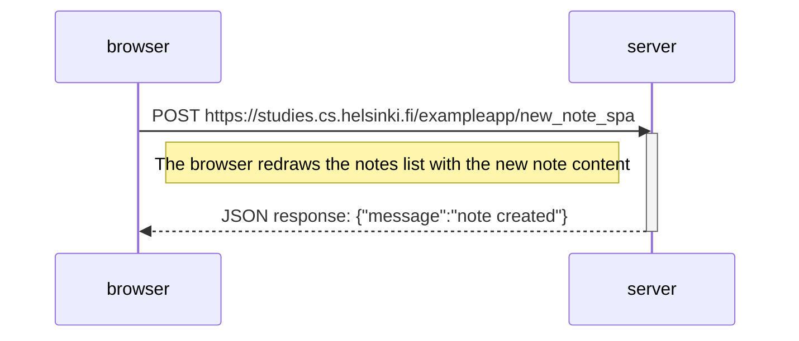

```mermaid
sequenceDiagram;
  participant browser;
  participant server;

  browser->>server: POST https://studies.cs.helsinki.fi/exampleapp/new_note_spa;
  activate server;

  Note right of browser: The browser redraws the notes list with the new note content

  server-->>browser: JSON response: {"message":"note created"}
  deactivate server
```
